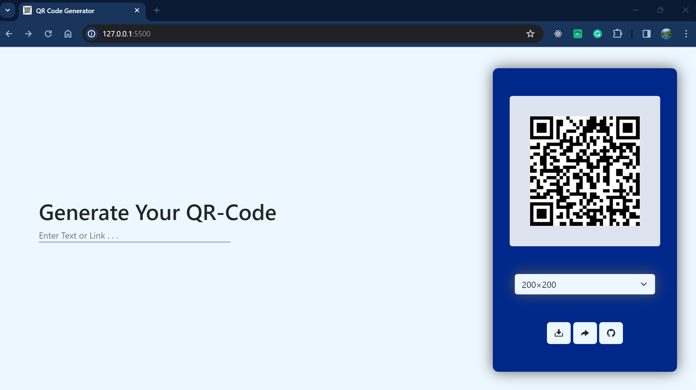
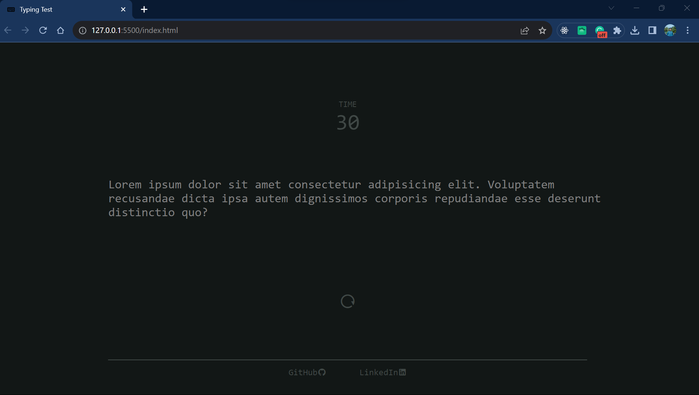
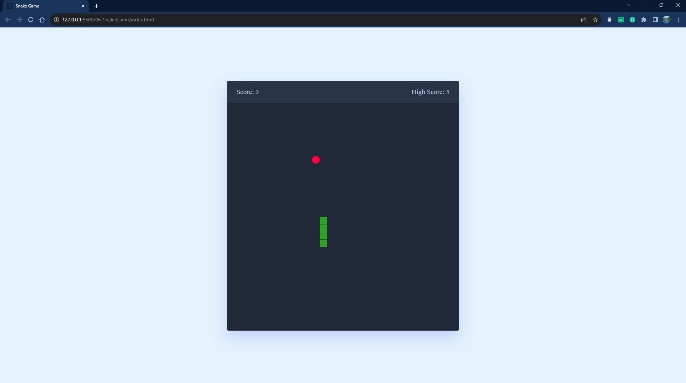
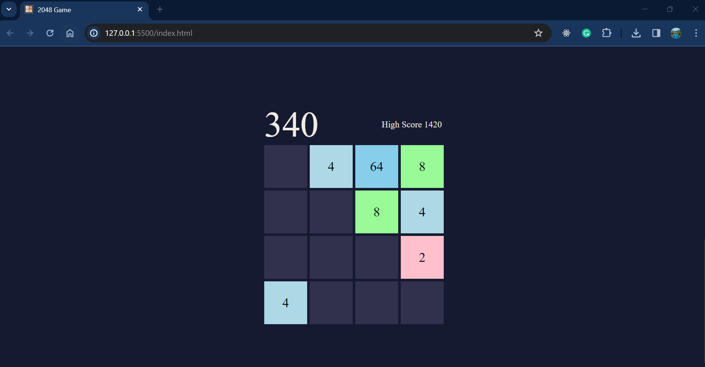

# 100_Days-100_JavaScript

I am learning JavaScript. My goal is to implement 100 JS projects beside learning.
Currently I am working on 7 no mini-project.

## #day1 PixelArtPalette

## #day2 Text to Speech

## #day3 Translate App

## #day4 QR Code Generator

## #day5 Typing Test

## #day6 Snake game

## #day7 Url Shorter

## #day8 Url Shorter

