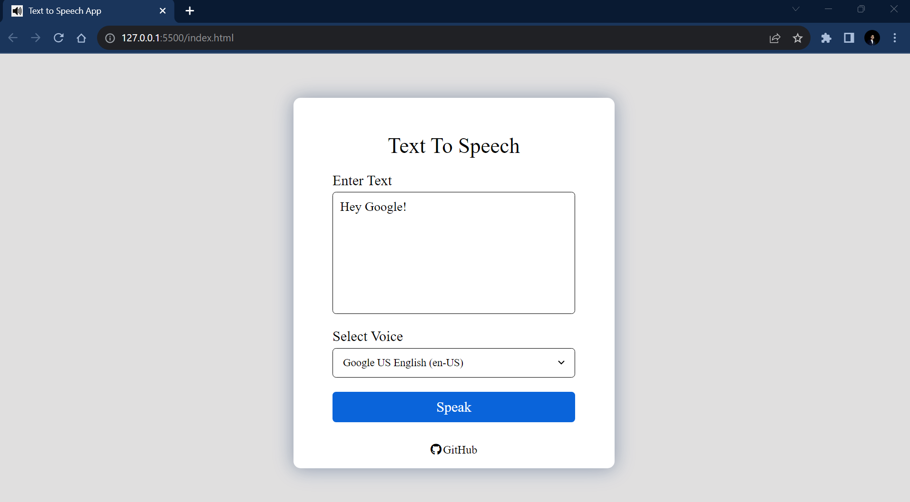
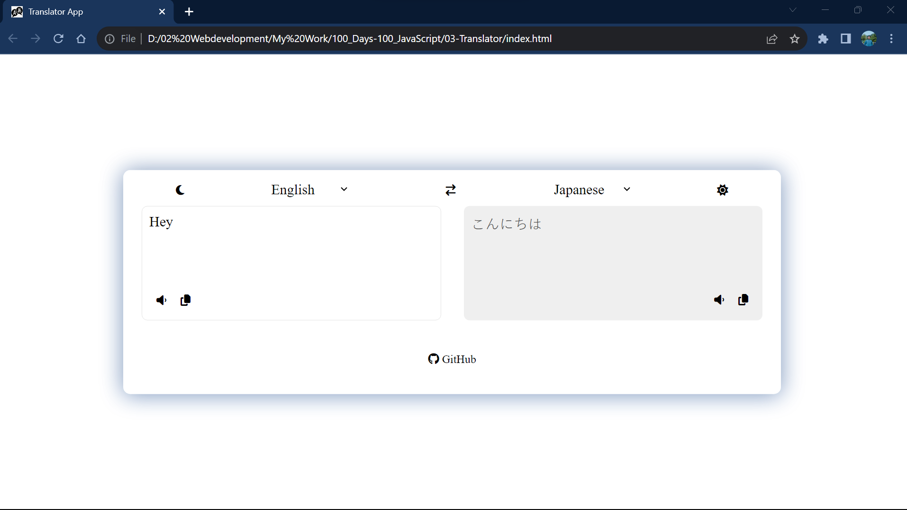

# 100_Days-100_JavaScript
I am learning JavaScript. My goal is to implement 100 JS projects beside learning.
Currently I am working on 4 no projest.

## #day1 PixelArtPalette

## #day2 Text to Speech

## #day3 Translate App

